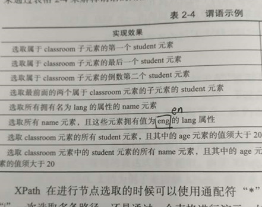
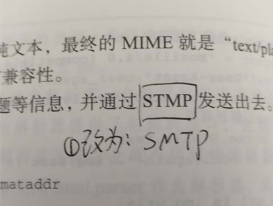
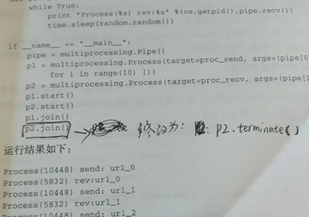

#### 一. 1.4.4.py中代码29行出现问题,对应书籍29页
原因: i 没有使用str强转类型
<br>
修改如下:
```python
for url in ["ImageUrl_"+str(i) for i in range(10)]:
```
感谢 [@jsqlzy](@jsqlzy)

#### 2. 书籍182页出现问题
原因: 笔误
<br>

<br>
将sqlite3改成MySQLdb

感谢 [@lg-Cat73](@lg-Cat73)

#### 3. 书籍P122-P123 CSS选择器表达式多出空格
原因:印刷错误
<br>

<br>

<br>
感谢 [@Judy0513](@Judy0513)

#### 4. 书籍P144和P156 soup.find_all('a', href = re.compile(r'/view/\d+.htm'))正则表达式有误
原因：百度词条的链接链接结构发生改变，不属于程序错误。
修改如下：
```python
links = soup.find_all('a', href=re.compile(r'/item/.*'))
```
感谢 [@Judy0513](@Judy0513)
#### 5.书籍P138页代码有误,多出空格
原因:笔误
<br>

<br>
修改如下：
```python
smtp_server = 'smtp.163.com'
```
感谢 [@shaodamao](@shaodamao)

#### 6.P58 --表2-4 实现效果第6行，应该是"这些元素拥有值为en的lang属性"
原因:笔误
<br>

<br>
感谢 [@Judy0513](@Judy0513)

#### 7.P305 def parse_item(self, response), def parse_body(self, response)两个函数排版
原因:排版问题
<br>
感谢 [@Judy0513 ](@Judy0513 ) 

#### 8.P29，上面那块代码后的文字，任务进程已经编写完成（应该为服务进程）
原因：笔误
<br>

<br>
感谢 [@wushicanASL](@wushicanASL) 

#### 9.P113,倒数第5行 Tag 的content属性 应为Tag的contents属性
原因：笔误
<br>

<br>
感谢 [@wushicanASL](@wushicanASL) 

#### 10. P137 5.3节Email提醒 开始 第三行，发送邮件的协议是STMP（应该为SMTP）
原因：笔误
<br>

<br>
感谢 [@wushicanASL](@wushicanASL) 

#### 11.P145和P152 存储成html,火狐打开出现乱码(其实可以使用火狐可以选择不同的编码)
解决添加如下代码:
<br>
```python
fout.write("<head><meta charset='utf-8'/></head>")
```

<br>
感谢 [@jsqlzy](@jsqlzy) 


#### 12.P21 代码有误
修改为：
```python
p2.terminate()
```
<br>


<br>
感谢 [@Judy0513 ](@Judy0513 ) 